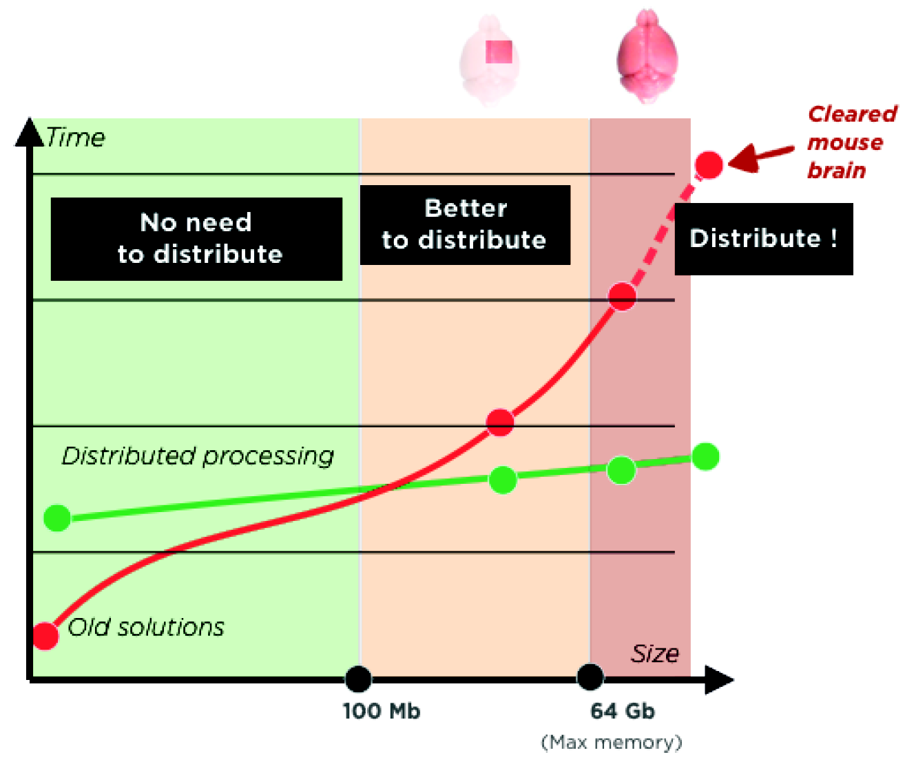
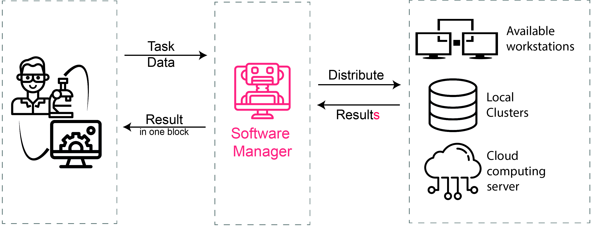
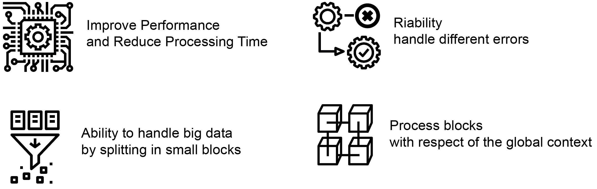
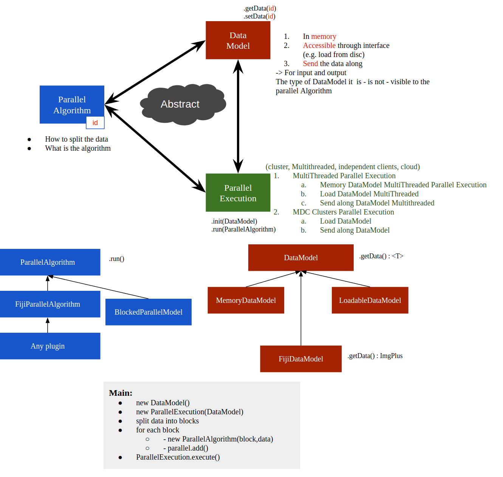

# ImageJ Distribution processing
### by || [Preibisch Lab](http://preibischlab.mdc-berlin.de) ||

ImageJ Distribution processing is a software manager, this manager helps you to handle big tasks using limited resources and time. 

The manager allows us to use less local compute power, Improved Performance and Reduced Processing Time and then Handle big tasks.

IT takes an abstract task and input and then distribute it using available resources.

Resources can be:
  - Local cluster
  - Other workstations in the local network
  -  Cloud server
 
Task can be:
  - Image process
  - Image analysis
  - Machine learning process



# Workflow


# Features




# Diagram




## Libraries used :

imgLib2: https://github.com/imglib/imglib2

scifio-bf: https://github.com/scifio/scifio

Apache kafka: https://kafka.apache.org/

JSch: http://www.jcraft.com/jsch/

Google guava: https://github.com/google/guava

Google Gson: https://github.com/google/gson

### Installation

requires [Docker](www.docker.com) to run, Install and start the server.

Kafka Server image for Docker: https://github.com/Landoop/fast-data-dev
#### install kafka Server
```sh
docker run --rm -it \
           -p 2181:2181 -p 3030:3030 -p 8081:8081 \
           -p 8082:8082 -p 8083:8083 -p 9092:9092 \
           -e ADV_HOST=127.0.0.1 \
           landoop/fast-data-dev
```

- add our topic 
First, access to Kafka command lines tools
```sh
docker run --rm -it --net=host landoop/fast-data-dev bash
```
- then add topic
```sh
kafka-topics --zookeeper 127.0.0.1:2181 --create --topic TASK_DONE --partitions 2 --replication-factor 1
```


### Todos

 - A lot!


